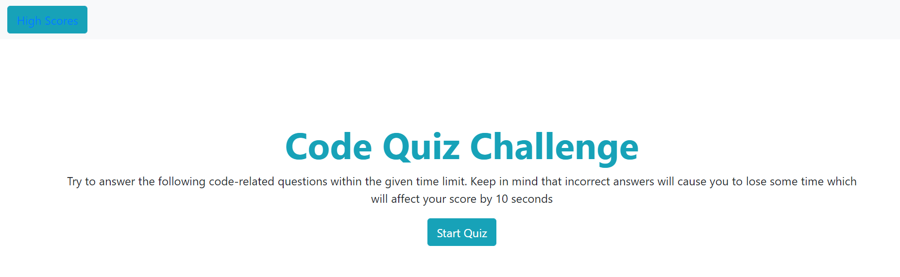

# code_quiz
[Code Quiz]()

# Description

For this assignment you had to create a quiz. The starting page had to have a link to the highscores and your instructions for the quiz. 
Once the quiz starts the timer should also start. Then it should iterate through your questions and the user should be able to see whether their answer is correct or wrong. 
Once the quiz is completed the user should see their score and be prompted to submit their initials to be placed on the highscore board. 

# Installation
To create this page I used Bootstrap elements to help me structure both an index.html and a highscore.html. 
I used 3 containers to separte the start page, the quiz and the final form. Doing so allowed me to hide the elements that I did not want to be seen on the initial load of the page.

Using the id's that are assigned to each element I acess them in javascript and then created methods to start the quiz, render the question, take in the user's info , store the score and clear the score board (Side Note: not all of these were implemented successfully , there are things that need to be improved upon.)

# Credits

I met with my tutor again as well as attended office hours to ask some questions. 

I also did some "Googling" as a resource for methods that I wasn't too confident in :

https://developer.mozilla.org/en-US/docs/Web/API/Location/replace

https://developer.mozilla.org/en-US/docs/Web/API/Event/stopPropagation

https://www.w3schools.com/jsref/met_win_settimeout.asp

https://developer.mozilla.org/en-US/docs/Web/JavaScript/Reference/Global_objects/Object/values#:~:text=enumerable%20property%20values.-,Description,values%20of%20the%20object%20manually.

https://developer.mozilla.org/en-US/docs/Web/API/Location/replace